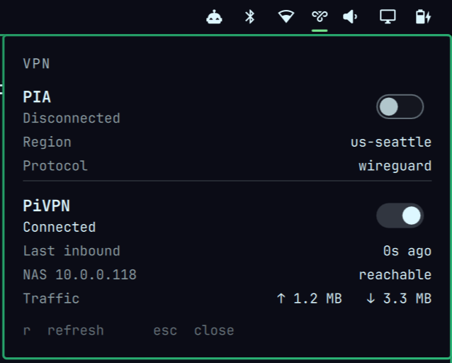

# Omarchy VPN

Multi-provider VPN status and control for the [Omarchy](https://omarchy.org/) bar.

One icon, one panel, every tunnel. Each provider gets its own section showing
connection state, region/endpoint, live traffic counters and an on/off switch.
Ships with **PIA** (Private Internet Access) and **WireGuard** providers — and
because Mullvad, NordVPN and Proton all run WireGuard underneath, they work
through the WireGuard provider with **no code at all**, just configuration.



## Why a separate widget

A VPN is not a network *connection* — it is a policy layered over one, so it
does not belong inside the Wi-Fi panel. Omarchy agrees: the built-in
`omarchy.tailscale` is a separate bar widget too.

## What it gets right

Two failure modes drove the design, both learned the hard way:

**WireGuard liveness is judged by `rx_bytes`, never `systemctl is-active`.**
`wg-quick` is a `Type=oneshot` unit — it reports *active* the moment the
interface and routes exist, **without ever contacting the peer**. A tunnel whose
server is powered off therefore reports "active" forever. This widget reads
`/sys/class/net/<iface>/statistics/rx_bytes`: zero means no handshake has ever
completed, and the icon goes red instead of green.

**An expired PIA login is latched, not sampled.** When PIA's stored token
expires the daemon gets HTTP 401 (`ApiUnauthorizedError`), retries a few
servers, gives up, and then sits at `Disconnected` — and stops logging new
401s. A time-windowed check forgets the login problem after a few minutes and
shows a bland "Disconnected", which is exactly when you go looking for why it
will not connect. Once a rejection has been seen the panel keeps saying
**LOGGED OUT** until a connection genuinely succeeds.

The bar icon shows **worst-case severity** across all providers, so one broken
tunnel is never hidden behind a healthy one.

| Colour | Meaning |
|---|---|
| green | connected and carrying traffic |
| yellow | answered before, now gone quiet (>240s) |
| red | up but no handshake, or PIA logged out |
| dim | deliberately off |

## Requirements

- Omarchy **Quattro** (4.x) with `omarchy-shell`
- A Nerd Font for the bar glyph (Omarchy ships one)
- **WireGuard provider:** `wireguard-tools`, and permission to start/stop the
  unit. Either a polkit rule for `wg-quick@<iface>.service`, or point
  `connectCommand`/`disconnectCommand` at your own wrapper scripts.
- **PIA provider:** the official PIA client (`/opt/piavpn/bin/piactl`). The
  provider is hidden automatically when it is not installed.

No other dependencies. Nothing is installed, and no configuration is written.

## Install

```bash
omarchy plugin add https://github.com/Paulie420/omarchy-vpn.git --enable
omarchy bar move paulie420.vpn --section right
```

## Remove

```bash
omarchy plugin remove paulie420.vpn
```

That deletes the plugin folder. If you added a `paulie420.vpn` block to
`~/.config/omarchy/shell.json`, delete that entry too — the plugin never
edits your configuration itself.

## Configure

All settings live in this widget's entry in `~/.config/omarchy/shell.json`.
Everything is optional. By default the PIA provider is on (and hides itself if
`piactl` is absent) and the WireGuard provider watches `wg0` — set `interface`
to whatever yours is actually called.

```jsonc
{
  "id": "paulie420.vpn",
  "refreshIntervalSec": 5,

  "pia": {
    "enabled": true,
    "label": "PIA"
  },

  // Either one object or a list of them -- see "Adding your VPN" below.
  "wireguard": [{
    "enabled": true,
    "label": "Homelab",
    "interface": "wg0",

    // Optional. When set, these run instead of `systemctl start/stop
    // wg-quick@<interface>`. Useful when connecting has to do more than raise
    // the interface -- e.g. dropping another VPN first and restoring it after.
    "connectCommand": "",
    "disconnectCommand": "",

    // Optional. A host behind the tunnel; the panel reports whether it is
    // reachable while connected.
    "reachabilityHost": ""
  }]
}
```

> **Note:** `omarchy plugin disable` followed by `enable` rewrites this entry
> back to a bare `{"id": "paulie420.vpn"}`, discarding the settings above.
> Re-add them afterwards.

## Adding your VPN

### Most VPNs need no code

Mullvad, NordVPN and Proton all run WireGuard under the hood, so the built-in
WireGuard provider already understands them. Point it at the right interface and
give it the provider's CLI for connect/disconnect. `wireguard` accepts a **list**,
so you can run several side by side:

```jsonc
{
  "id": "paulie420.vpn",
  "wireguard": [
    { "label": "Homelab", "interface": "wg0",
      "reachabilityHost": "192.168.1.10" },

    { "label": "Mullvad", "interface": "wg0-mullvad",
      "connectCommand": "mullvad connect",
      "disconnectCommand": "mullvad disconnect" }
  ]
}
```

Starting points for the common providers. **Verify the interface name on your own
machine** rather than trusting this table — vendors rename things between versions:

| VPN | Interface (typical) | Connect | Disconnect |
|---|---|---|---|
| Mullvad | `wg0-mullvad` | `mullvad connect` | `mullvad disconnect` |
| NordVPN (NordLynx) | `nordlynx` | `nordvpn connect` | `nordvpn disconnect` |
| Proton (WireGuard) | `proton0` | `protonvpn-cli connect` | `protonvpn-cli disconnect` |
| Plain `wg-quick` | `wg0` | *(default: `systemctl start wg-quick@wg0`)* | |

**To find yours:** connect the VPN by whatever means you normally use, then run

```bash
ip -br link            # the new interface appears while connected
wg show                # WireGuard-based VPNs list their interface here
```

Whatever name shows up is your `interface`. Leave `connectCommand` and
`disconnectCommand` empty if `systemctl start/stop wg-quick@<interface>` is the
right way to control it; set them when the vendor has its own CLI, or when
connecting must do more than raise the interface.

### When you need a provider file

Write one only when the VPN is **not** WireGuard-based, or when it exposes state
the generic provider cannot see. That is why PIA has its own file: it reports an
account region, a protocol, and — crucially — an expired-login condition that
looks identical to "switched off" unless you read the daemon's log.

A provider is one QML file implementing this interface:

```
Properties  enabled  label  connected  busy  rxBytes  txBytes
            severity   "ok" | "warn" | "error" | "off"
            stateText  short status line, e.g. "Connected"
            hintText   optional explanation shown when something is wrong

Functions   connectVpn()  disconnectVpn()  toggle()  refresh()
```

Drop `MyVpnProvider.qml` beside the others, declare it in `BarWidget.qml`
next to `PiaProvider`, and add it to the `providers` list.

### Writing one with an AI assistant

This is a good task to hand to a coding assistant, because the contract is small
and there are two working examples in the repo. Give it this prompt:

> I'm writing a provider for the Omarchy `paulie420.vpn` bar widget.
> Read `WireGuardProvider.qml` and `PiaProvider.qml` in this repo as reference —
> they define the interface I must implement.
>
> Write `<Name>Provider.qml` for **<your VPN>**. It controls the VPN with
> `<connect command>` / `<disconnect command>`, and I can read its status with
> `<status command>`, which outputs `<paste real output here>`.
>
> Requirements:
> - Root is `Item { visible: false }`, imports `QtQuick` and `Quickshell.Io`.
> - Poll state in ONE `Process` per `refresh()` call using
>   `stdout: StdioCollector { waitForEnd: true; onStreamFinished: ... }`.
>   Do **not** use `FileView` on `/sys/class/net/...` — those paths disappear
>   when the tunnel drops and the watcher never re-resolves.
> - Expose exactly: enabled, label, connected, busy, rxBytes, txBytes,
>   severity, stateText, hintText, and connectVpn/disconnectVpn/toggle/refresh.
> - `severity` must be "error" when the VPN claims to be up but is carrying
>   nothing — never trust a service-manager "active" as proof of a live tunnel.
>
> Then show me the entry to add to `~/.config/omarchy/shell.json`.

Validate whatever it produces before trusting it:

```bash
omarchy plugin validate .
qmllint -I "$OMARCHY_PATH/shell" <Name>Provider.qml
omarchy-shell shell rescanPlugins
```

Then watch for runtime errors, which QML only reports when the component loads:

```bash
qs log -p "$OMARCHY_PATH/shell" --tail 100
```

**Pull requests adding providers are welcome** — if you get one working for a VPN
that isn't covered here, please send it.

## Development

```bash
omarchy plugin validate .
qmllint -I "$OMARCHY_PATH/shell" BarWidget.qml PiaProvider.qml WireGuardProvider.qml
omarchy-shell shell rescanPlugins
```

## Privacy

Address and traffic rows are hidden while a provider is disconnected — with the
tunnel down, "Public IP" is your **real** address, and showing it as though it
were a VPN property leaks it into any screenshot of the panel.

The plugin makes no network requests of its own. It only runs local commands
(`systemctl`, `wg`, `piactl`, `ping`) and reads local files.

## Licence

MIT — see [LICENSE](LICENSE). Use it, change it, ship it, however you like.
